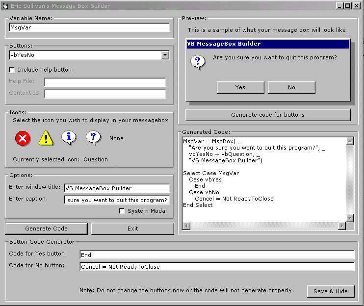



## MsgBox Maker v2\.0

### Description

This is a program that will allow to create message boxes easily and fast.

it has an auto preview so when you type the text or whatnot it shows you.

it will automaticly create the select case for the manipulation of the buttons

and allows you to create the button codes right from the program and puts it all

together in the output textbox all as one code. all you do is copy and paste!!.

PLEASE rate this program and leave your comments!
 
### More Info
 

             |
---                |---
**Submitted On**   |2000-06-04 03:26:30
**By**             |[Eric Sullivan](https://github.com/Planet-Source-Code/PSCIndex/blob/master/ByAuthor/eric-sullivan.md)
**Level**          |Intermediate
**User Rating**    |4.1 (65 globes from 16 users)
**Compatibility**  |VB 5\.0, VB 6\.0
**Category**       |[Complete Applications](https://github.com/Planet-Source-Code/PSCIndex/blob/master/ByCategory/complete-applications__1-27.md)
**World**          |[Visual Basic](https://github.com/Planet-Source-Code/PSCIndex/blob/master/ByWorld/visual-basic.md)
**Archive File**   |[CODE\_UPLOAD6415642000\.zip](https://github.com/Planet-Source-Code/eric-sullivan-msgbox-maker-v2-0__1-8617/archive/master.zip)

